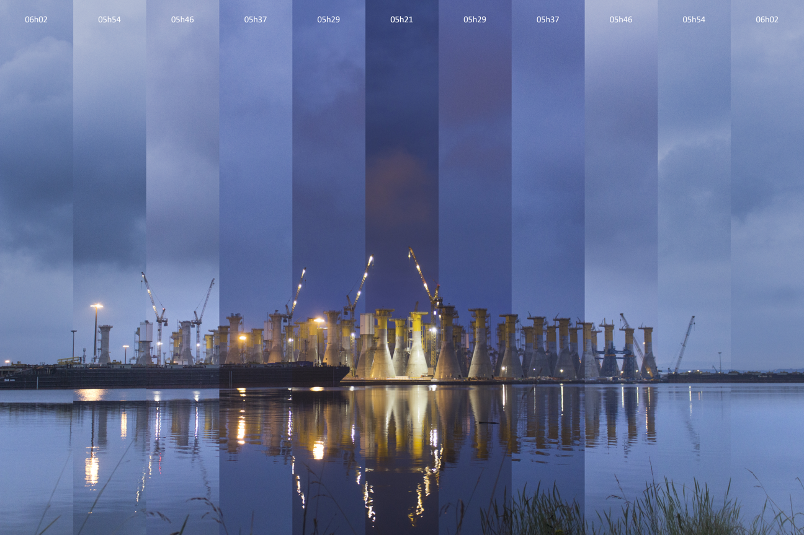

# timelapse_slicer
Make one picture with vertical stripes from each pictures of a timelapse

### with eleven stripes, centered on the beginning of the timelapse

### with one thousand stripes, centered on the beginning of the timelapse

These examples were made with the first 600 pictures from this timelapse

https://youtu.be/vzaiubdxFK4

Notebook yet in french